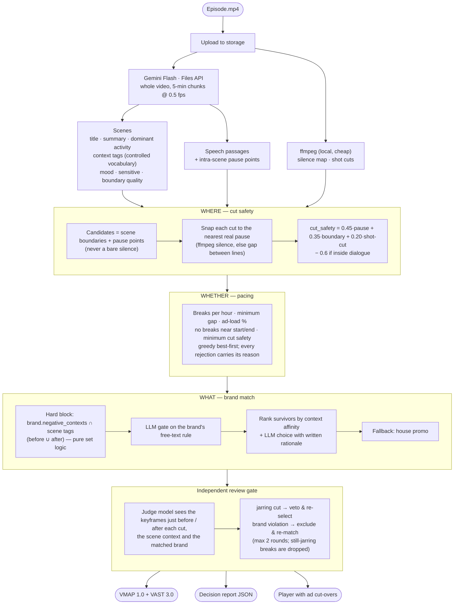

# Cuepoint

**Context-aware ad-break placement for long-form video.**

Give Cuepoint an episode and it answers the three questions an ad-ops editor would: **where** a cut is non-jarring, **whether** a break is warranted under your pacing rules, and **what** brand belongs in that moment. Every decision is explained, exported as a standards-compliant **VMAP** manifest, and playable in-app — the player pauses at each cue, plays the matched creative, and resumes.

- Live demo: https://hoichoi-hackathon-sisanta.vercel.app
- API: https://hoichoi-hackathon-sisanta.onrender.com

---

## How it works



### Perception
The episode is uploaded **once** to Gemini's Files API and read at a deliberately low rate — one frame every two seconds plus continuous audio, in 5-minute chunks analysed four at a time — so a 25-minute episode costs about 90k tokens and ~30 seconds of model time. This single pass is what tells the system what each scene is about, its mood, who is speaking and when; nothing downstream re-sends video. Results are cached by file hash, so re-placing, re-judging or tuning pacing never touches the model again. In parallel, ffmpeg produces two cheap, precise signals locally: a **silence map** (sub-second) and **shot changes**. Scene analysis is schema-constrained: every scene is tagged only from a controlled vocabulary (`backend/app/vocab.py`), which is what makes brand blocking deterministic later.

Why not just ask the model "where do the ads go"? Because the parts that must be exact are the parts a model is worst at: pacing arithmetic, a negative-context block that must never be talked around, and cut timing to the frame. The model contributes understanding; code makes the decisions, so every one of them can be shown.

### Where
Only semantic points become candidates — scene boundaries and pause points Gemini flagged inside long scenes. A quiet moment in the middle of a tense scene never becomes a break because nothing proposes it. The model's timestamps are whole seconds (it samples at 0.5 fps), so each candidate is **snapped** to the nearest real pause from ffmpeg's silence map (~10 ms precision) and scored from explainable components: pause length, the model's own boundary quality, and whether a shot change coincides. A cut that still lands inside dialogue is never used. In practice a fifth of candidates move by up to a few seconds, and several per episode are dropped — those would have been mid-sentence cuts.

### Whether
Pacing rules — chosen when an episode is submitted and adjustable afterwards — decide how many breaks an episode may carry and where they may not go. Selection is greedy best-first, and every rejected candidate keeps the rule that rejected it ("would cut mid-dialogue", "break budget reached", "less than 5 min from another break", …). Rules are adjustable per episode and re-run in seconds without re-analysing.

### What
Brand matching has two gates and a ranker, plus **competitive separation**: scenes that themselves advertise something (a sponsor segment, product placement, an on-screen ad) are detected during analysis with the promoted brand and its product category, and any brand in the same category is hard-blocked within three minutes of that content — a cooking show's spice sponsor never gets a rival food ad placed beside it. A slot where **no** brand passes the gates is treated as a bad slot rather than forced: it is vetoed and the next-best candidate is tried; only if nothing works does a house promo appear, and then it is flagged for review. Gate 1 is a set intersection between the brand's *negative contexts* and the tags of the scenes on either side of the cut — no model can talk its way past it. Gate 2 lets a model enforce the brand's free-text rule. Survivors are ranked by context affinity with the *preceding* scene (dominant activity wins) and a model picks one with a one-sentence rationale. If everything is blocked, a house promo is used rather than a bad ad. Because brands and scenes share one vocabulary, a brand nobody has seen before is matched with zero code changes.

### Review gate
A second, stronger model independently audits each placement from the keyframes around the cut plus the scene and brand context. It can veto a jarring cut (the next-best candidate takes its place) or reject a brand for that slot (the matcher re-runs without it). Anything still judged jarring after two rounds is dropped — fewer breaks beat a bad one.

### Human in the loop
Breaks the system is not confident about — a merely acceptable cut, a neutral brand fit, a forced brand, a low safety score — are not inserted silently. They appear in the episode view as **Needs your call** with the specific doubt, and the user inserts or rejects them. Any inserted break can be removed at any time. Only inserted breaks reach the manifest and the player.

---

## Product

- **Episodes** — upload (browser → Vercel Blob) or paste a URL, choose the pacing rules for the episode, then watch progress with stage, percent and time remaining; a toast with a View action when it finishes.
- **Episode view** — custom player with break markers on the seek bar, scene strip (colour = mood; hover for summary and tags), each break with its brand, rationale, why-this-cut, blocked brands and the reviewer's verdict; breaks held for review with Insert / Reject, Remove on any break; pacing sliders that re-place in seconds; a list of every other cut considered and why it lost.
- **Brands** — a fictional catalogue per user, seeded with eight brands; add one in a dialog (contexts to seek, contexts to avoid, a free-text rule, creative colours); click a row to preview its creative.
- **Outputs** — VMAP manifest and decision report per episode.

## Accounts

Sign up with a username and password (unique usernames, scrypt-hashed passwords). Sessions are HS256 JWTs with a 7-day expiry sent as a bearer token. Everything — episodes, analyses, placements and the brand catalogue — is private to the account. Postgres tables: `users`, `jobs (owner_id → users)`, `brands (owner_id → users)`.

## Stack

| Layer | Choice |
|---|---|
| Frontend | Next.js 16 (app router), Tailwind v4, shadcn/ui, lucide icons — Vercel |
| Video storage | Vercel Blob (browser uploads, streamed playback) |
| Backend | FastAPI + ffmpeg, Docker — Render |
| Perception | Gemini Flash (video understanding, Files API) |
| Judgement | Gemini Pro for matching and the review gate (Claude via API/Bedrock if configured) |
| Persistence | Postgres (Supabase) |

## Repo layout

```
backend/   FastAPI service (Python 3.12, uv)
  app/pipeline/audio.py     ffprobe, silence map, shot cuts, keyframes
  app/pipeline/gemini.py    Files API upload, chunked analysis with JSON schema, cache, retries
  app/pipeline/scoring.py   WHERE (cut safety) + WHETHER (pacing)
  app/pipeline/matching.py  WHAT (hard block → rule gate → rank)
  app/pipeline/judge.py     independent review gate
  app/pipeline/vmap.py      VMAP / VAST emitter
  app/auth.py, app/store.py accounts, persistence, migrations
  scripts/run_local.py      run the pipeline on a local file, no server
frontend/  Next.js app
docs/      reference material
```

## Run locally

```bash
# backend
cd backend && cp .env.example .env      # GEMINI_API_KEY, optional SUPABASE_DB_URL / JWT_SECRET
uv sync && uv run uvicorn app.main:app --reload --port 8000
uv run python scripts/run_local.py ~/Downloads/episode.mp4

# frontend
cd frontend && pnpm install && pnpm dev  # http://localhost:3000  (NEXT_PUBLIC_API_URL in .env.local)
```

## Deploy

- **Backend → Render** (Docker, `render.yaml`): `GEMINI_API_KEY`, `SUPABASE_DB_URL`, `JWT_SECRET`, `CREATIVE_BASE_URL` (`https://<frontend>/creatives`). Render's disk is ephemeral; jobs live in Postgres and interrupted runs resume on restart.
- **Frontend → Vercel**: root `frontend/`, `NEXT_PUBLIC_API_URL`, a connected Blob store (`BLOB_READ_WRITE_TOKEN`).

## API

All `/jobs` and `/brands` routes require `Authorization: Bearer <token>`.

| Method | Path | Purpose |
|---|---|---|
| POST | `/auth/signup` · `/auth/login` | `{username, password}` → `{token}` |
| GET | `/auth/me` | current user |
| POST | `/jobs` `{url,title,pacing}` · `/jobs/upload` (multipart, `pacing` JSON field) | analyse an episode |
| GET | `/pacing` | default pacing rules |
| GET | `/jobs` · `/jobs/{id}` | list / detail (scenes, breaks, rejected candidates) |
| POST | `/jobs/{id}/place` `{pacing}` | re-run scoring + matching only |
| POST | `/jobs/{id}/breaks/{break_id}` `{action}` | approve a held break or remove one |
| POST | `/jobs/{id}/retry` · DELETE `/jobs/{id}` | retry / remove |
| GET | `/jobs/{id}/vmap.xml` · `/jobs/{id}/debug.json` | outputs (accept `?token=`) |
| GET/POST/DELETE | `/brands` | the caller's catalogue |
| GET | `/vocab` | context tag vocabulary |
